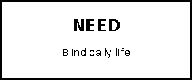

# 700 Blind

**Open-source interaction patterns for interfaces that still work when users cannot reliably see, touch, type, or continuously attend to the screen.**

700 Blind is a Kiara Lab R&D OSS program. It starts from accessibility and extreme-use constraints, turns those constraints into working interaction patterns, tests them through real software and dogfooding, and publishes the reusable results.

> Accessibility → Extreme Use Cases → General UX

<p align="center">
  
</p>

<p align="center">
  <a href="https://kiara-02-lab-social.github.io/700-Blind/#listen">🔊 Listen in English</a>
  &nbsp;•&nbsp;
  <a href="https://kiara-02-lab-social.github.io/700-Blind/#listen">🔊 日本語で聞く</a>
</p>

> The README remains fully screen-reader friendly. The audio guide is an optional convenience layer.


## Simple idea / シンプルな考え方

**700 experiments and app kits for blind people's daily life.**

We build **700 small experiments, UI patterns, and app components** inspired by the everyday needs of blind people.

Developers can use them **piece by piece**, like a chef using recipes from a cookbook — copy one idea, adapt one component, or combine several patterns into a new product.

**What:** 700 small accessibility experiments and reusable app components.  
**Why:** Make everyday digital experiences easier for blind people, while discovering better interfaces for everyone.  
**How:** **Build → Test → Learn → Open Source**

> **700 experiments. 700 recipes. One open cookbook for accessible software.**

### 日本語

**視覚障害のある方の日常生活をより便利にする、700個の実験とアプリキット。**

視覚障害のある方の日常の課題を起点に、**小さなUI、機能、アプリ、操作方法を700個実験し、使える形で公開**していきます。

開発者は、料理人がレシピ本から必要なレシピを選ぶように、**必要な部分だけを1個ずつ引用・改良・組み合わせて、自分のアプリに利用できます。**

**What:** アクセシビリティのための700個の小さな実験・UI・アプリ部品。  
**Why:** 視覚障害のある方の日常を便利にし、そこから誰にとっても使いやすいUIを発見する。  
**How:** **つくる → 試す → 学ぶ → OSSとして公開する**

> **700の実験。700のレシピ。アクセシブルなソフトウェアをつくるための、オープンなレシピブック。**

## Why this exists

Most UI libraries organize components by visual form: buttons, sheets, lists, inputs, navigation.

700 Blind organizes work around **interaction problems**:

- Can a user complete an action without seeing the screen?
- Can an interface be controlled by voice without ambiguous labels?
- Can motion be removed without removing meaning?
- Can an error be recovered from without visual hunting?
- When should an AI agent act automatically, and when should a human decide?

The last question connects the project to Kiara's **Boundary Theory** research.

## Boundary Theory

Every pattern can describe the Human–Agent Boundary across five stages:

| Stage | Question |
| --- | --- |
| Observe | Who notices the information? |
| Understand | Who interprets the context? |
| Decide | Who makes the decision? |
| Act | Who executes? |
| Verify | Who checks the result? |

Each stage can be owned by **Human**, **Agent**, or **Shared**.

The research question is not only **Can the agent do it?** but **Should the agent do it, and under what conditions?**

## First flagship patterns

1. **VoiceAction** — semantic, voice-addressable actions.
2. **AccessibleFormField** — native form semantics with explicit labels and hints.
3. **RiskAwareAction** — different confirmation behavior for low/medium/high-risk actions.
4. **AccessibleStatus** — nonvisual state feedback.
5. **ReducedMotionTransition** — preserve meaning when motion is reduced.
6. **RecoverableAction** — failure → explanation → retry.

## Install

Add this package in Xcode using the repository URL, then:

```swift
import SevenHundredBlind
```

## Example

```swift
RiskAwareAction(risk: .high) {
    deleteCustomerRecord()
} label: {
    Label("Delete customer", systemImage: "trash")
}
```

A corresponding research contract might be:

```swift
let boundary = BoundaryContract(
    observe: .agent,
    understand: .agent,
    decide: .human,
    act: .agent,
    verify: .shared
)
```

## Public architecture

- **GitHub** — source of truth, issues, releases, contributions.
- **Swift Package Manager** — reusable implementation.
- **GitHub Pages** — visual catalog and research notes.
- **CodePen** — optional web analogues for concepts such as focus management, accessible dialogs, reduced motion, and error recovery.
- **DocC** — API and research documentation.

## Pattern page contract

Every published pattern should answer:

- What problem does this solve?
- Who benefits?
- What is the demo?
- What is the SwiftUI implementation?
- VoiceOver: PASS / PARTIAL / NOT TESTED
- Voice Control: PASS / PARTIAL / NOT TESTED
- Dynamic Type: PASS / PARTIAL / NOT TESTED
- Reduce Motion: PASS / PARTIAL / NOT TESTED
- Human–Agent Boundary
- Known failure cases
- Research question

## Origin

The initial work grew from a real SwiftUI catalog built and recorded from working iOS builds. The next step is to transform a component catalog into an **Accessible Interaction Pattern Library**.

## License

MIT. See [LICENSE](LICENSE).
